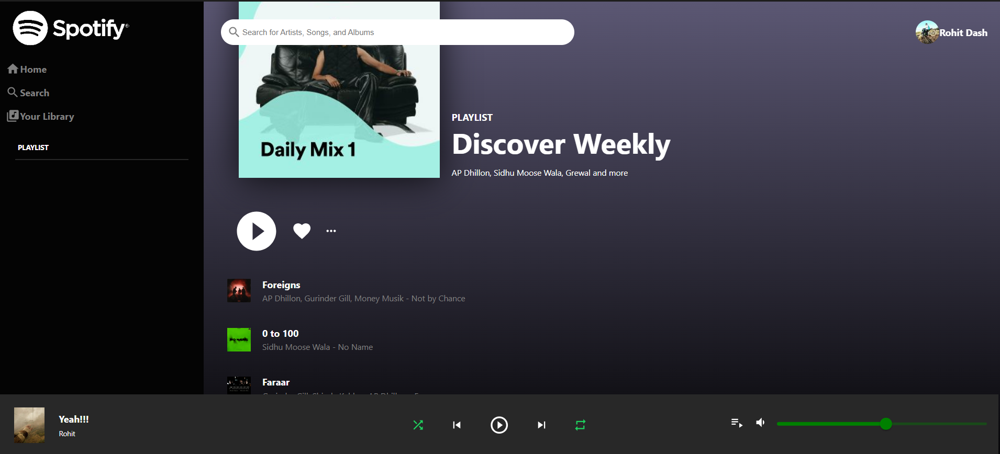

# React Spotify Clone App

This project is a simple Spotify Player built with React. It allows users to log in with their Spotify account, view playlists, and play music.

## Features

- User authentication using the Spotify API.
- Display user playlists and the Discover Weekly playlist.
- Play music and control playback.

## Technologies Used

- React
- React Context API
- Spotify Web API
- Material-UI

## Screenshots



## How to Run

1. Clone this repository to your local machine.

```bash
git clone https://github.com/rohitdash08/Spotify_clone
```

2. Navigate to the project directory.

cd spotify

3. Install dependencies.

npm install
npm start
